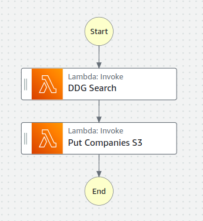
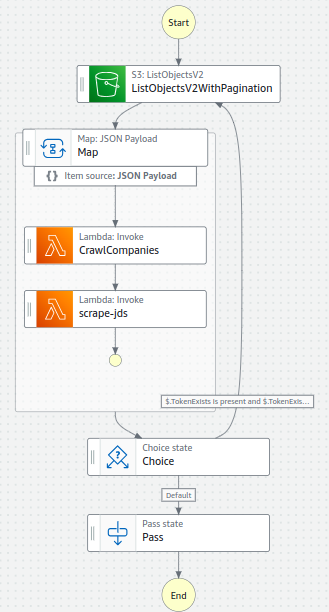

# Jobs
This is a collection of utilities for scraping job descriptions from the web.

There are two AWS state machines: `ddg_search`  performs DuckDuckGo searches (right now only for jobs posted on Greenhouse ATS), and keeps track of companies which post those jobs on S3.

The `crawl-scrape` state machine lists companies in the S3 bucket, fetches all the job posting urls from the company job boards, and then performs a map step which scrapes all the job metadata asynchronously. This is also stored on an S3 Bucket for later analysis.

I am currently working on utilities to filter the jobs on S3 by criteria such as title, location and perform alerting via AWS SNS

After that I'm planning on training some ML models on the job descriptions in order to rank them by relevance to a candidate's resume.